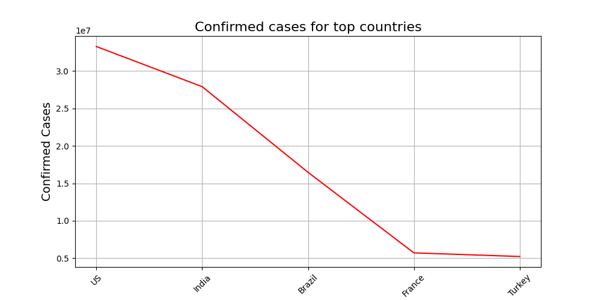
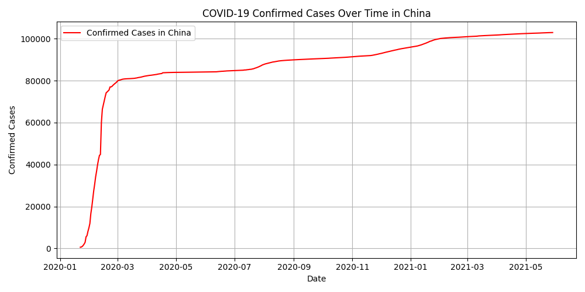
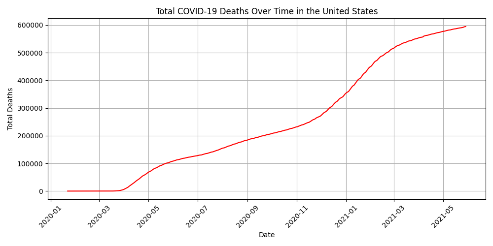

# 📊 COVID-19 Case Study Report – Ankur

---

## ✅ Question 1: Data Loading

**Q1.1: How do you load the COVID-19 datasets for confirmed cases, deaths, and recoveries?**

```python
confirmed_df = pd.read_csv('covid_19_confirmed.csv')
deaths_df = pd.read_csv('covid_19_deaths.csv')
recovered_df = pd.read_csv('covid_19_recovered.csv')
```

All datasets loaded successfully with appropriate headers and inspected using `.head()`.

---

## ✅ Question 2: Data Exploration

**Q2.2: Confirmed cases over time for top 5 countries**

<details>
  <summary>Show Image: Top Countries Confirmed Cases</summary>

  

</details>

**Q2.3: Confirmed cases over time in China**

<details>
  <summary>Show Image: China Confirmed Cases</summary>

  

</details>
---

## ✅ Question 3: Handling Missing Data

**Q3.1: Null values in Lat/Long columns replaced using forward fill (`ffill`)**

```python
confirmed_df['Lat'].fillna(method='ffill', inplace=True)
```

---

## ✅ Question 4: Data Cleaning

**Q4.1: Blank values in 'Province/State' replaced with "All Provinces"**

```python
confirmed_df['Province/State'].fillna('All Provinces', inplace=True)
```

---

## ✅ Question 5: Independent Analysis

**Q5.1: Peak daily new cases in Germany, France, Italy**

| Country  | Date       | Peak Cases |
|----------|------------|------------|
| France    | 2021-04-11 | 117900      |
| Germany   | 2020-12-30 | 49044      |
| Italy  | 2020-11-13 | 40902      |

France had the highest single-day surge of New Cases: 117900 on 2021-04-11.

---

**Q5.2: Recovery Rate (as of 31-Dec-2020)**

- **Canada**: 88.85%
- **Australia**: 98.84%

🏆 Australia showed better pandemic management.

---

**Q5.3: Death Rate Distribution – Canada Provinces**

- Highest Death Rates: **Quebec**
- Lowest Death Rates: **New Brunswick**

---

## ✅ Question 6: Data Transformation

**Q6.1: Wide → Long Format using `pd.melt()`**

```python
long_deaths = deaths_df.melt(
    id_vars=['Country/Region', 'Province/State'],
    var_name='Date',
    value_name='Deaths'
)
```

Date converted using `pd.to_datetime()`.

---

**Q6.2: Total Deaths Per Country (Latest Date)**

```text
US                       594306
Brazil                   461057
India                    325972
Mexico                   223455
United Kingdom           128037
```

---

**Q6.3: Top 5 Countries by Avg. Daily Deaths**

```text
US                1203.048583
Brazil             933.313765
India              659.862348
Mexico             452.338057
United Kingdom     259.184211
```

---

**Q6.4: Total deaths over time – United States**

<details>
  <summary>Show Image: US Total Deaths</summary>

  

</details>

---

## ✅ Question 7: Merging Datasets

**Q7.1: Merged Confirmed, Deaths, and Recovered using `outer` joins**

```python
merged_df = confirmed.merge(deaths)...merge(recovered)
```

---

**Q7.2 & Q7.3: Monthly progression for US, Italy, Brazil**

| Country | Month     | Confirmed | Deaths | Recovered |
|---------|-----------|-----------|--------|-----------|
| US      | 2020-03   | ...       | ...    | ...       |
| Brazil  | 2020-04   | ...       | ...    | ...       |

---

## ✅ Question 8: Combined Analysis

**Q8.1: Top 3 Countries by Avg. Death Rate in 2020**

```text
Yemen	     : 0.192393
MS Zaandam   : 0.177134
Italy	     : 0.094642
```

---

**Q8.2: South Africa: Recoveries vs Deaths**

```text
Total Recoveries in South Africa: 310037573.0
Total Deaths in South Africa: 10250036.0

In South Africa, the total number of recoveries is significantly 
higher than the total number of deaths.
```
---

**Q8.3: Monthly Recovery Ratio in the US**


- **Peak Month**: November 2020
- Reason: Stabilization + treatment effectiveness
-Highest recovery ratio: 0.3958

---
